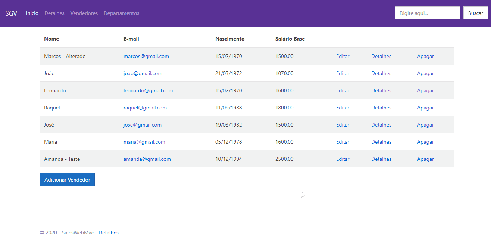

# Sistema de Gerenciamento de Vendedores
Esse é um sistema para gerenciar os vendedores de determinada loja e ses respectivos departamentos, assim como suas vendas | C# ASP .NET

# Demo

##Operações

Na tela inicial, pode-se acessar o registro de vendores cadastrados na base

##Editar

##Detalhes

## Tecnologias Usadas
* C#
*ASP .NET
*Bootstrap

